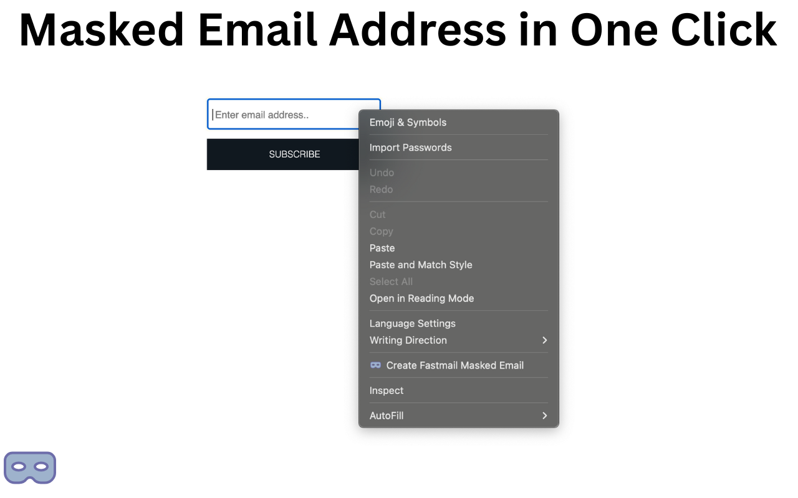
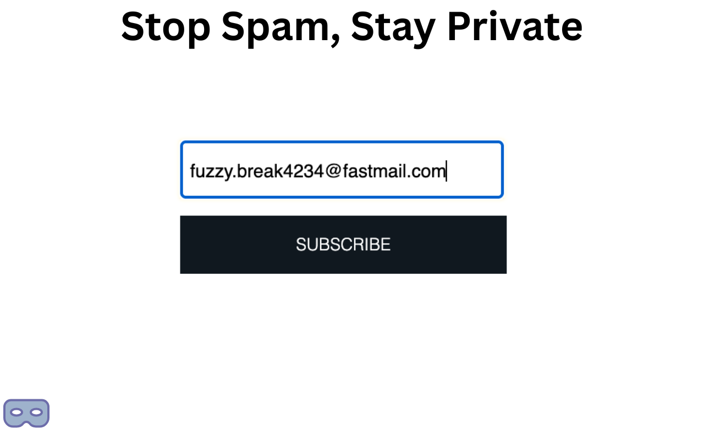

# Fast Masked Mail Creator

An unofficial Chrome extension for the easy creation of new, single-purpose Fastmail masked emails.

## What's Fastmail Masked Email?
Fastmail's masked email feature allows you to create unique email addresses that forward to your main inbox. You can
use a different email address for every service or newsletter you sign up for, and if you start receiving spam, you can
easily pinpoint who sold your email address, and disable that specific masked email without affecting your main email
address.

## Why?
I love Fastmail's masked email feature, but going to the Fastmail settings page to create a new masked email every time
I need one is cumbersome. This extension streamlines the process, allowing you to create new masked emails with just
two clicks.

This functionality comes bundled with 1Password and Bitwarden, but if you're using something else, like Chrome's
built-in password manager, this extension is for you!

## API Token
To use this extension, you'll need to generate an API token for your Fastmail account. You can do this in the [Fastmail
settings](https://app.fastmail.com/settings/security/tokens/new). I recommend creating a new token specifically for this
extension, so it's easier to revoke later if needed.

For security reasons, make sure the token **only** has the "Masked Email" scope.

The token is stored locally in your browser's local storage and is never sent to any server other than Fastmail's.

## Privacy
The extension does not collect any data about you or your usage of the extension.

If you run into any problems, please open an issue on the Github repository.

## Referral
Still not using Fastmail? Use my [referral link](https://join.fastmail.com/0983c12c) to get 10% off your first year!
